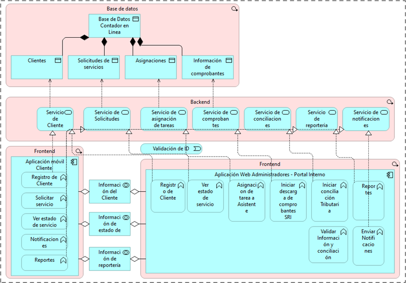

# Información del estudiante

Nombre: Jaramillo Lizaldez
Correo: (tu correo institucional o personal)

# Información de la empresa

Nombre: Jaramillo Lizaldez Asesores Contables
Actividad económica:
Servicios profesionales de contabilidad, asesoría contable y cumplimiento tributario.

Descripción:

Jaramillo Lizaldez Asesores Contables es una firma dedicada a brindar servicios de gestión contable, declaraciones tributarias, asesoría financiera y obligaciones laborales.
Dentro del proceso de transformación digital, surge la necesidad de mejorar la experiencia del cliente mediante una plataforma que permita:

Gestión digital de solicitudes
Seguimiento del estado de cada trámite
Asignación automática a asistentes y contadores
Comunicación clara con el cliente

La propuesta planteada se enfoca en desarrollar una plataforma web para declaración de impuestos a la renta, permitiendo a clientes, asistentes y contadores interactuar dentro de un flujo automatizado.

# Arquitectura de Aplicaciones Objetivo

Este proyecto implementa parte del diseño definido en el Prácticum 3, siguiendo la arquitectura de aplicaciones objetivo para la solución “Contador en Línea”.

El objetivo principal es ofrecer:

Portal del cliente

Gestión de solicitudes

Seguimiento del estado del proceso

Dashboard con información de utilidad

Interfaz moderna basada en Tailwind y HeroUI

## Enlaces del proyecto
Aplicación desplegada en Vercel

https://contador-en-linea.vercel.app/

Repositorio GitHub

https://github.com/MCJQ90/contador-en-linea

Instalación

# Para ejecutar el proyecto localmente:

Clonar o hacer Fork del repositorio:
git clone https://github.com/MCJQ90/contador-en-linea.git

Instalar dependencias:
npm install

Instalar react-icons (si no está instalado):
npm i react-icons@4.10.1

Ejecutar el proyecto:
npm run dev

Ahora el sitio estará disponible en:
http://localhost:3000

# Autenticación Google (Opcional para extra puntos)

El proyecto incluye el botón “Iniciar sesión con Google”, el cual puede conectarse con OAuth 2.0 si agregas un proveedor real.

Si deseas activarlo, debes generar las credenciales en Google Cloud.

# Crear credenciales en Google

Ir a:

https://console.cloud.google.com/apis

Luego:

Credenciales → Crear credenciales → ID de cliente OAuth
Tipo: Aplicación web

En URIs de redireccionamiento agrega:

http://localhost:3000/api/auth/callback/google

# Crear archivo .env.local

Crea el archivo en la raíz del proyecto:

GOOGLE_CLIENT_ID=TU_ID
GOOGLE_CLIENT_SECRET=TU_SECRET
NEXTAUTH_URL=http://localhost:3000/
NEXTAUTH_SECRET=VALOR_GENERADO

Genera el secreto con:

openssl rand -base64 32

# Para despliegue en Vercel

Debes agregar las mismas variables en:

Vercel → Settings → Environment Variables

GOOGLE_CLIENT_ID
GOOGLE_CLIENT_SECRET
NEXTAUTH_URL
NEXTAUTH_SECRET

Sin estas variables, la autenticación real con Google no funciona.

## Funcionalidades del proyecto
Página de inicio con branding
Login con correo y contraseña
Login simulado con Google
Dashboard del cliente

Nueva solicitud

Mis solicitudes

Perfil

Tarjetas informativas

Progreso visual

Roles (cliente, asistente, contador)

# Flujo de solicitud para Declaración de Impuesto a la Renta

Selección del año fiscal

Guardado en localStorage

Asignación simulada de Asistente y Contador

Actualización de estado

# Listado de solicitudes

Estado: Pendiente, En proceso, Finalizado

Fecha

Año fiscal

Responsable asignado

## Tecnologías utilizadas

Next.js 14 / 15 (App Router)
HeroUI v2
Tailwind CSS
JavaScript / TypeScript
React Icons
LocalStorage
Vercel

## Licencia

Proyecto académico — uso educativo.
Puedes extenderlo y mejorarlo libremente.
Licensed under the [MIT license](https://github.com/heroui-inc/next-app-template/blob/main/LICENSE).